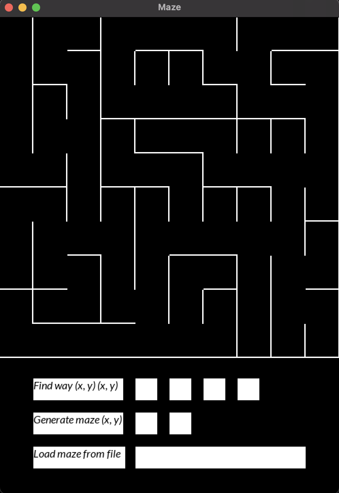
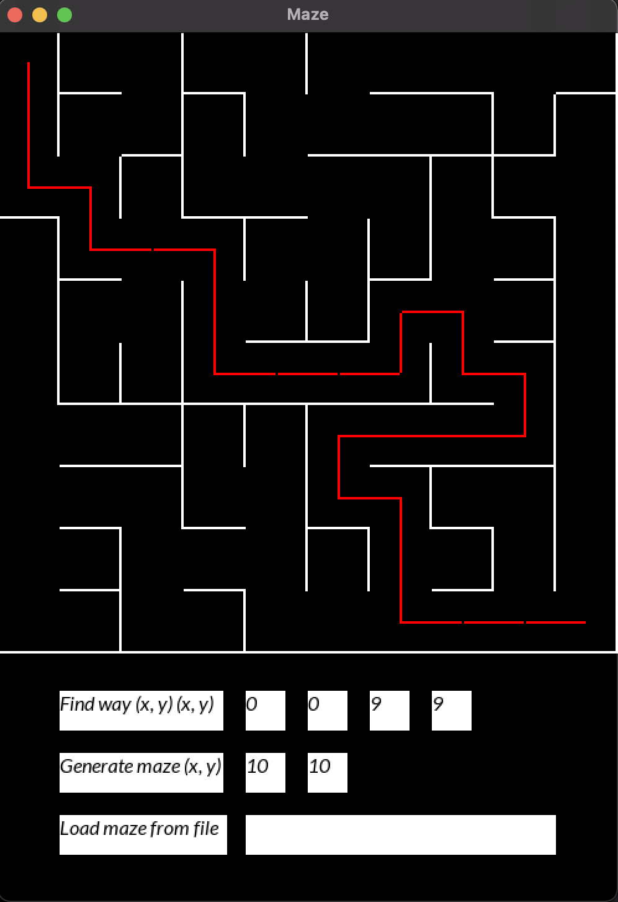
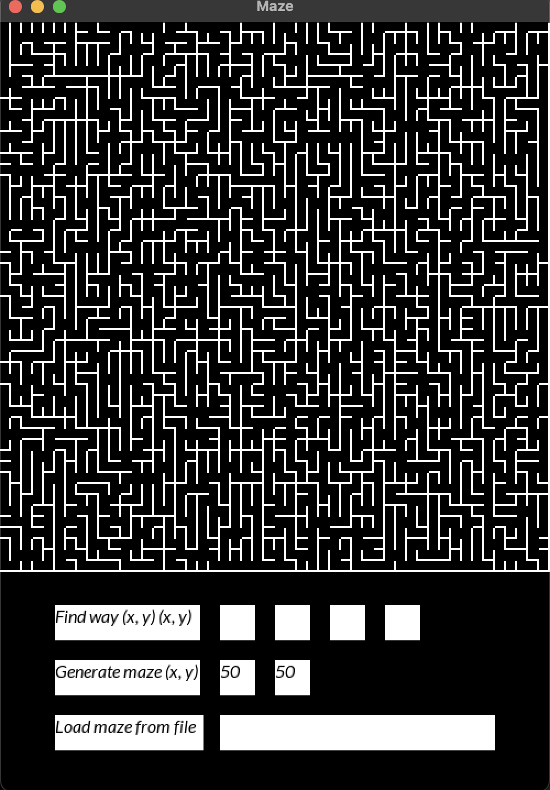
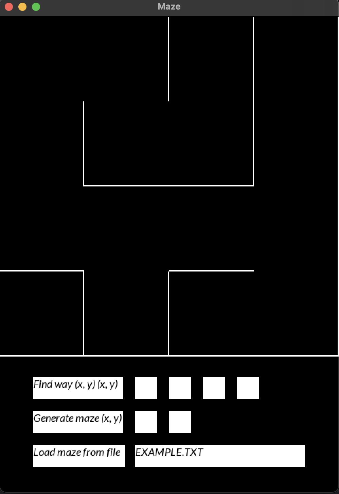

# Maze

Implementation of the Maze project.



## Build and install

You can use Makefile and Cmake

### Makefile

For base installing, checking and testing use default make command
```bash
make
```

For install Maze without testing use make install
```bash
make install
```

After installing, you can start application
```bash
make start
```

For testing Maze app use make testing
```bash
make tests
make leaks
```
For uninstall app, use next command
```bash
make uninstall
```

### Cmake

For install and testing app, use next sequence of actions:
```bash
mkdir build
cd build
cmake ..
cmake --build -j4
./Test
./Maze
```

## How to use

Maze creator randomly generate walls using Euler algorithm.

Mainwindow have 3 buttons:

- Find way - create way between two points with (x, y) positions. Positions are limited by the size of the maze.



- Generate maze - create maze with given size. Max size 50x50.



- Load from file - load maze image from file, maze should look like this:

Height Width
(Positions of vertical walls)

(Positions of horizontal walls)

Example:

4 4
0 1 1 1
1 0 1 1
0 0 0 1
1 1 0 1

0 0 0 0
0 1 1 0
1 0 1 0
1 1 1 1


